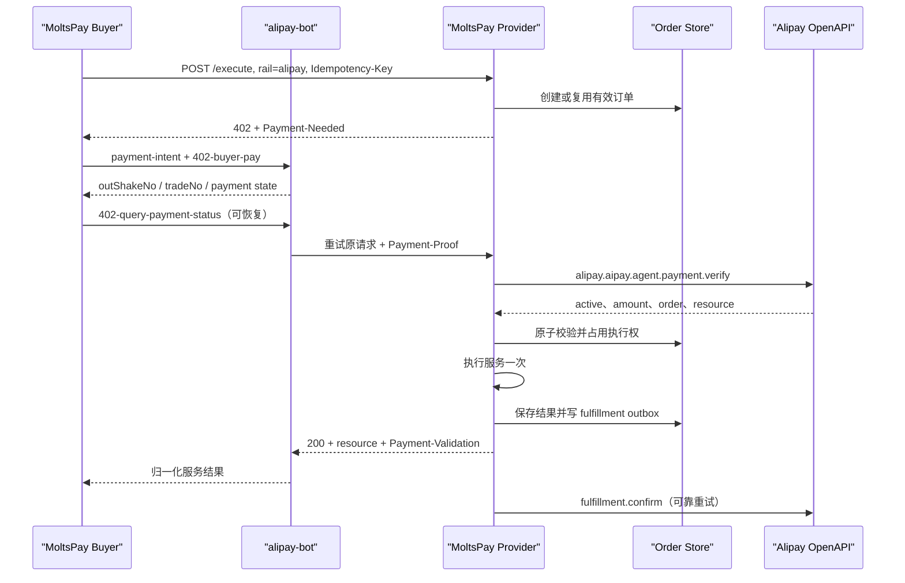

# MoltsPay 支付宝 AI 按量付费（A402）一期设计

> 状态：Design Draft  
> 目标版本：待定  
> 最后更新：2026-08-14  
> 范围：服务端收款、买方 CLI、支付宝余额充值、MCP、错误模型与完整测试  
> 支付产品：支付宝 AI 按量付费（A402）

## 1. 背景与结论

MoltsPay 当前已经实现链上 x402、托管余额和 WeChat Pay Native rail。支付宝一期需要同时覆盖两种业务：

1. 使用支付宝直接购买 Provider 的 AI 服务；
2. 使用支付宝为 Provider 托管余额充值，随后继续用 `balance` rail 消费。

支付宝 AI 按量付费不是 WeChat Native 二维码协议的字段替换版。两者的共同点是都属于 CNY 交互式支付，但协议生命周期不同：

| 维度 | WeChat Native | 支付宝 AI 按量付费 |
|---|---|---|
| 付款挑战 | `code_url` 二维码 | HTTP 402 `Payment-Needed` Header |
| 买方凭证 | 微信商户订单号 | `Payment-Proof` Header |
| 支付确认 | 商户查询微信订单 | `alipay.aipay.agent.payment.verify` |
| 服务交付 | `X-Payment` 重试 | 携带 `Payment-Proof` 重试原请求 |
| 履约确认 | MoltsPay 内部 settle | `alipay.aipay.agent.fulfillment.confirm` |
| 买方依赖 | 微信扫码 | 官方 `alipay-bot` 和已开通的 AI 钱包 |

因此一期采用以下结论：

- `alipay` 是一等支付 rail，不是区块链 chain；
- 服务端直接实现支付宝官方 A402 Header 和 OpenAPI；
- 买方通过官方 `alipay-bot` 完成钱包授权和付款，MoltsPay 不接触用户支付宝账户凭据；
- 不把 `Payment-Proof` 包进通用 `X-Payment`；
- 服务支付与余额充值复用同一个 A402 验证内核，但使用不同的资源类型和履约处理器；
- 服务端必须持久化订单、幂等状态和履约 outbox，不能只依赖支付宝验证结果；
- 现有 Git 基线中的旧支付宝实现只作为参考，新实现按本文协议重写，不直接恢复。

## 2. 目标和非目标

### 2.1 一期目标

- Provider 可在服务清单中配置 `alipay` rail；
- 未付款请求返回合法的 `402 Payment Required + Payment-Needed`；
- 已付款请求通过 `Payment-Proof` 完成验凭、业务执行、防重放和履约回执；
- `moltspay pay --rail alipay` 可完成直接购买服务；
- Provider 托管余额支持支付宝充值；
- CLI 会话可恢复，进程退出后可以继续查询；
- MCP 暴露支付宝支付和支付宝余额充值的显式生命周期工具；
- 所有失败返回稳定机器错误码，并区分是否可重试；
- 单元、契约、集成、安全、故障注入和沙箱测试均有明确验收项。

### 2.2 一期非目标

- 不实现支付宝当面付、付款码、订单码、JSAPI、预授权或代扣；
- 不自行实现用户支付宝钱包，不保存用户账号 token、授权码或支付密码；
- 不把支付宝商户私钥写入仓库、会话文件、日志或 MCP 返回值；
- 不自动完成商家签约、应用上线或生产密钥配置；
- 不承诺离线退款能力；如后续需要退款，应单独设计支付宝退款流程；
- 不让通用 `moltspay_pay` MCP 工具隐式发起长时间交互支付。

## 3. 术语和命名

| 名称 | 说明 |
|---|---|
| A402 | 支付宝面向 AI 服务的 HTTP 402 按量付费方案 |
| rail | MoltsPay 支付通道；本设计新增 `alipay` |
| `out_trade_no` | MoltsPay Provider 生成的商户订单号，全局唯一 |
| `trade_no` | 支付宝交易号，由支付宝返回 |
| `out_shake_no` | `alipay-bot` 查询/恢复支付使用的单号；以 CLI 实际结构化输出为准 |
| `resource_id` | 本次付款绑定的资源标识，用于防止支付凭证跨资源使用 |
| `service_id` | 支付宝 AI 按量付费产品中的商户服务 ID |
| Payment-Needed | Provider 返回给买方的 Base64URL 账单 Header |
| Payment-Proof | 买方付款后重试资源请求携带的 Base64URL 支付凭证 Header |
| Payment-Validation | Provider 成功验证并履约后返回的验证摘要 Header |
| fulfillment outbox | 服务已交付但支付宝履约回执尚未成功时的可靠重试队列 |

## 4. 总体架构

```text
Buyer CLI / MCP
  ├─ MoltsPay public API
  ├─ AlipayBuyerClient
  │    ├─ secure local session store
  │    └─ official alipay-bot process adapter
  └─ Provider HTTP API
       ├─ A402 request router
       ├─ AlipayFacilitator
       │    ├─ bill signing
       │    ├─ OpenAPI verify
       │    └─ fulfillment confirm
       ├─ AlipayOrderStore (SQLite)
       ├─ service executor
       ├─ balance ledger
       └─ fulfillment outbox worker
```

建议的代码边界：

| 组件 | 职责 |
|---|---|
| `src/moltspay/alipay.py` | 买方会话、`alipay-bot` 适配、恢复和结果归一化 |
| `src/moltspay/server/facilitators/alipay.py` | 账单生成、RSA2 签名、OpenAPI 验证和履约回执 |
| `src/moltspay/server/alipay_store.py` | 订单、幂等执行结果、凭证摘要和 fulfillment outbox |
| `src/moltspay/client.py` | 对外公开 API 和 rail 路由 |
| `src/moltspay/server/server.py` | Header 路由、HTTP 状态、服务/充值履约分派 |
| `src/moltspay/cli.py` | `pay --rail alipay` 和余额充值参数、交互输出 |
| `src/moltspay/mcp/server.py` | 严格 schema、确认门、结构化错误和生命周期工具 |
| `src/moltspay/exceptions.py` | 稳定错误类型和错误码 |

## 5. 配置模型

### 5.1 Provider 配置

`moltspay.services.json` 中新增 `provider.alipay`，并在 `chains` 中允许声明字符串 `alipay`。这里沿用 `chains` 字段是为了兼容现有 manifest；运行时仍将其解释为 rail，而非区块链网络。

```json
{
  "provider": {
    "name": "Example Provider",
    "wallet": "0x...",
    "chains": ["base", "balance", "wechat", "alipay"],
    "alipay": {
      "app_id": "2026xxxxxxxxxxxx",
      "seller_id": "2088xxxxxxxxxxxx",
      "seller_name": "Example Provider",
      "balance_topup_service_id": "aipay_balance_topup",
      "private_key_path": "/secure/path/alipay-app-private-key.pem",
      "alipay_public_key_path": "/secure/path/alipay-platform-public-key.pem",
      "gateway_url": "https://openapi.alipay.com/gateway.do",
      "order_db_path": "data/alipay-a402.sqlite",
      "default_timeout_seconds": 1800,
      "fulfillment_retry_limit": 12
    }
  }
}
```

配置约束：

- `private_key_path` 只允许文件路径，不在 manifest 中支持生产私钥明文；
- 私钥文件启动时检查普通文件、非符号链接、当前用户可读，建议权限 `0600`；
- `alipay_public_key_path` 是支付宝平台公钥，不是应用公钥；
- `gateway_url` 默认生产网关，沙箱必须显式覆盖；
- `order_db_path` 必须在 Provider 可写目录内，不允许路径穿越；
- 启动健康检查应验证密钥可解析和配置完整，但不输出密钥内容；
- 正式环境的产品开通、应用发布和密钥配置是上线前置条件，不由 SDK 自动完成。

### 5.2 Service 配置

```json
{
  "id": "text-to-video",
  "name": "Text to Video",
  "price": 0.1,
  "currency": "USDC",
  "function": "generate_video",
  "alipay": {
    "price_cny": "0.10",
    "goods_name": "AI 视频生成",
    "service_id": "aipay_video_generation",
    "resource_id": "/execute?service=text-to-video",
    "pay_timeout_seconds": 1800
  }
}
```

约束：

- `price_cny` 使用十进制字符串，最小 `0.01`，最多两位小数；
- `goods_name` 非空且限制长度；
- `service_id` 必填，且必须是支付宝侧为该服务注册的 ID，不回退到内部 service/skill ID；
- `resource_id` 缺省时规范化为 `/execute?service=<urlencoded service id>`；
- 相同 `out_trade_no` 对应的金额、资源和服务 ID 创建后不可修改。
- 余额充值使用独立的 `provider.alipay.balance_topup_service_id`，不得复用隐式默认值。

### 5.3 服务发现

`GET /services` 和 `GET /.well-known/agent-services.json` 为每个服务增加 rail 元数据，供 CLI 在付款前展示币种和价格：

```json
{
  "id": "text-to-video",
  "name": "Text to Video",
  "price": 0.1,
  "currency": "USDC",
  "paymentRails": {
    "alipay": {
      "available": true,
      "interactive": true,
      "protocol": "a402",
      "currency": "CNY",
      "amount": "0.10"
    }
  }
}
```

发现结果只用于展示和 rail 选择；最终应付金额、订单和资源仍以 Provider 签名的 `Payment-Needed` 为准。旧客户端可通过 Pydantic `extra="allow"` 忽略该字段。

## 6. 支付宝 AI 付款 OpenAPI 和 Header 数据格式

本节字段以支付宝 AI 按量付费官方文档和官方示例为准。所有 JSON 示例中的值均为占位值。

### 6.1 `Payment-Needed`

Provider 在没有有效 `Payment-Proof` 时返回：

```http
HTTP/1.1 402 Payment Required
Payment-Needed: <base64url-without-padding>
Content-Type: application/json
Cache-Control: no-store
```

响应体用于诊断，支付方识别以 Header 为准：

```json
{
  "code": "payment_needed",
  "message": "Payment is required to access this resource",
  "resourceId": "/execute?service=text-to-video",
  "requestId": "req_01J..."
}
```

`Payment-Needed` 解码后的 JSON：

```json
{
  "protocol": {
    "out_trade_no": "MPA20260814ABC123",
    "amount": "0.10",
    "currency": "CNY",
    "resource_id": "/execute?service=text-to-video",
    "pay_before": "2026-08-14T18:30:00+08:00",
    "seller_signature": "<base64-rsa2-signature>",
    "seller_sign_type": "RSA2",
    "seller_unique_id": "2088xxxxxxxxxxxx"
  },
  "method": {
    "seller_name": "Example Provider",
    "seller_id": "2088xxxxxxxxxxxx",
    "seller_app_id": "2026xxxxxxxxxxxx",
    "goods_name": "AI 视频生成",
    "seller_unique_id_key": "seller_id",
    "service_id": "aipay_video_generation"
  }
}
```

签名原文由下列字段按 key 字典序排列，以 `key=value` 和 `&` 拼接：

```text
amount=0.10&currency=CNY&goods_name=AI 视频生成&out_trade_no=MPA20260814ABC123&pay_before=2026-08-14T18:30:00+08:00&resource_id=/execute?service=text-to-video&seller_id=2088xxxxxxxxxxxx&service_id=aipay_video_generation
```

实现要求：

- UTF-8；
- RSA2，即 RSA PKCS#1 v1.5 + SHA-256；
- `seller_signature` 使用标准 Base64；
- 整个账单使用 Base64URL，无 padding；
- `pay_before` 使用带时区的 ISO 8601；
- 原始字段字符串直接参与签名，禁止签名后再归一化金额或时间；
- Header 解码后最大 16 KiB，超过限制直接拒绝。

### 6.2 `Payment-Proof`

买方完成支付后重试原请求：

```http
POST /execute HTTP/1.1
Accept-Payment-Rail: alipay
Payment-Proof: <base64url-payment-proof>
Idempotency-Key: req_01J...
Content-Type: application/json
```

`Payment-Proof` 解码后的结构：

```json
{
  "protocol": {
    "payment_proof": "7cf8a6a93c924e13...",
    "trade_no": "2026xxxxxxxxxxxxxxxxxxxxxxxxxxxx"
  },
  "method": {
    "client_session": "<buyer-client-session>"
  }
}
```

实现要求：

- 同时接受规范 Base64URL 和带 padding 的兼容输入；
- 只读取登记字段，拒绝错误类型、空值和超长值；
- `payment_proof`、`trade_no`、`client_session` 必填；
- 原始凭证不写日志、不写业务响应；
- 数据库只保存 `SHA-256(payment_proof)`，不保存完整凭证；
- `trade_no` 与 `out_trade_no` 必须建立唯一约束。

### 6.3 商户支付凭证验证 OpenAPI

OpenAPI 方法：

```text
alipay.aipay.agent.payment.verify
```

业务请求：

```json
{
  "payment_proof": "7cf8a6a93c924e13...",
  "trade_no": "2026xxxxxxxxxxxxxxxxxxxxxxxxxxxx",
  "client_session": "<buyer-client-session>"
}
```

网关公共参数：

```json
{
  "app_id": "2026xxxxxxxxxxxx",
  "method": "alipay.aipay.agent.payment.verify",
  "format": "JSON",
  "charset": "utf-8",
  "sign_type": "RSA2",
  "timestamp": "2026-08-14 18:01:00",
  "version": "1.0",
  "biz_content": "<compact-json>",
  "sign": "<gateway-request-signature>"
}
```

成功响应：

```json
{
  "alipay_aipay_agent_payment_verify_response": {
    "code": "10000",
    "msg": "Success",
    "amount": "0.10",
    "out_trade_no": "MPA20260814ABC123",
    "trade_no": "2026xxxxxxxxxxxxxxxxxxxxxxxxxxxx",
    "resource_id": "/execute?service=text-to-video",
    "active": true
  },
  "sign": "<alipay-response-signature>"
}
```

验证成功必须同时满足：

1. HTTP 请求成功；
2. OpenAPI 响应签名验证成功；
3. `code == "10000"`；
4. `active is true`；
5. `amount` 等于本地订单金额；
6. `out_trade_no` 等于本地订单号；
7. `resource_id` 等于本地订单资源；
8. `trade_no` 尚未绑定到其他订单；
9. 订单未过期且未被其他请求占用执行。

任何单项失败都不能执行服务或充值。OpenAPI 网络不可用属于“验证状态未知”，不得创建第二次支付，也不得当成凭证无效。

### 6.4 商家履约回执 OpenAPI

OpenAPI 方法：

```text
alipay.aipay.agent.fulfillment.confirm
```

业务请求：

```json
{
  "trade_no": "2026xxxxxxxxxxxxxxxxxxxxxxxxxxxx"
}
```

成功响应：

```json
{
  "alipay_aipay_agent_fulfillment_confirm_response": {
    "code": "10000",
    "msg": "Success",
    "trade_no": "2026xxxxxxxxxxxxxxxxxxxxxxxxxxxx"
  },
  "sign": "<alipay-response-signature>"
}
```

履约回执在业务结果持久化之后加入 outbox。首次发送可以在当前请求内进行，但失败不得撤销已经交付的结果；后台按指数退避重试并记录最终状态。

### 6.5 `Payment-Validation`

服务成功后返回一个不含支付凭证的验证摘要：

```json
{
  "trade_no": "2026xxxxxxxxxxxxxxxxxxxxxxxxxxxx",
  "out_trade_no": "MPA20260814ABC123",
  "validated": true,
  "resource_id": "/execute?service=text-to-video"
}
```

上述 JSON 使用 Base64URL 无 padding 编码后放入：

```http
Payment-Validation: <base64url-validation-summary>
```

Provider 同时更新 CORS：

```http
Access-Control-Allow-Headers: Content-Type, X-Payment, Accept-Payment-Rail, Payment-Proof, Idempotency-Key
Access-Control-Expose-Headers: X-Payment-Required, X-Payment-Response, Payment-Needed, Payment-Validation
```

## 7. 服务端直接支付链路



### 7.1 初始请求

买方发送：

```json
{
  "service": "text-to-video",
  "params": {"prompt": "a robot dancing"},
  "rail": "alipay"
}
```

同时发送：

```http
Accept-Payment-Rail: alipay
Idempotency-Key: <stable-request-id>
```

Provider 根据 `Idempotency-Key + service_id + buyer request fingerprint` 复用尚未过期的订单，避免网络重试生成多个账单。

### 7.2 付款后请求

Provider 看到 `Payment-Proof` 后进入专用 A402 路由，不再尝试解析 `X-Payment`。解析和 OpenAPI 验证成功后，在数据库事务中执行：

1. 锁定本地订单；
2. 比较金额、订单号、资源 ID 和过期时间；
3. 绑定 `trade_no` 和 proof hash；
4. 从 `offered/verified` 原子切换为 `executing`；
5. 只有获得执行权的请求可以调用业务 handler。

重复请求处理：

- 已 `completed` 且请求绑定相同订单和资源：返回缓存的历史结果，不重复执行；
- 正在 `executing`：返回 `409 alipay_execution_in_progress`，允许退避重试；
- 相同 `trade_no` 用于不同订单或资源：返回 `409 alipay_replay_detected`；
- 已付款但本地订单不存在：返回 `404 alipay_order_not_found`，进入人工对账，不要求用户再次支付。

### 7.3 服务执行失败

支付已经完成后，业务执行失败不能返回新的 402 诱导重复付款。Provider 应：

- 将订单标记为 `delivery_failed`；
- 保存可安全展示的失败摘要；
- 返回 `500 service_execution_failed_after_payment` 和订单关联 ID；
- 相同请求重试时按照服务幂等策略恢复或返回同一失败；
- 后续退款/补偿属于独立产品流程，一期只保留人工处理状态和审计数据。

## 8. 买方 SDK 与 `alipay-bot` 适配

### 8.1 本地会话模型

会话保存在 `~/.moltspay/alipay-sessions/<payment_session_id>.json`：

```json
{
  "paymentSessionId": "mpay_alipay_01J...",
  "status": "pending",
  "requestId": "req_01J...",
  "resourceUrl": "https://provider.example/execute",
  "method": "POST",
  "requestBody": "<serialized-json>",
  "outShakeNo": "<optional>",
  "tradeNo": "<optional>",
  "outTradeNo": "MPA20260814ABC123",
  "paymentUrl": "<optional>",
  "createdAt": "2026-08-14T10:00:00Z",
  "updatedAt": "2026-08-14T10:00:00Z",
  "expiresAt": "2026-08-14T10:30:00Z",
  "lastErrorCode": null,
  "lastError": null,
  "result": null
}
```

状态集合：

```text
created -> pending -> processing -> completed
                   -> rejected
                   -> expired
                   -> unknown
```

`unknown` 表示外部命令结果不确定，允许用同一会话恢复，禁止自动重新创建付款。

目录权限建议 `0700`，文件原子写入并设为 `0600`。会话不保存完整 `Payment-Proof`、钱包 token、授权码或商户私钥。

### 8.2 命令适配顺序

收到 402 后执行：

```text
alipay-bot payment-intent
  --session-id <session-id>
  --intent-summary <human-readable-purpose>
  --framework moltspay

alipay-bot check-wallet

alipay-bot 402-buyer-pay
  --file <0600 challenge file>
  --resource-url <original URL>
  --resource-type http
  --session-id <session-id>
  --intent-summary <same purpose>
  --framework moltspay
  --method POST
  --data <original body>

alipay-bot 402-query-payment-status
  --out-shake-no <out-shake-no>
  --resource-url <original URL>
  --resource-type http
  --method POST
  --data <original body>
```

适配约束：

- 调用 `subprocess` 时使用参数数组且 `shell=False`；
- `Payment-Needed` 优先写入权限为 `0600` 的 challenge 文件，避免出现在进程参数列表；
- `--intent-summary` 必须取当前原始请求的支付目的，不能省略或使用泛化文本；
- `402-query-payment-status` 可能查询付款、重试资源并自动发送买方履约确认，属于有副作用操作；
- `402-buyer-fulfillment-ack` 只作为兼容/恢复入口，不在正常路径重复调用；
- 优先解析官方 CLI 的结构化 JSON 输出；兼容文本解析必须有固定 fixture 和严格字段校验；
- CLI 非零退出、空输出、冲突字段和未知状态都不能推断为支付成功；
- 日志只记录命令名、退出码、耗时和脱敏错误，不记录 Header、proof 或完整请求体。

### 8.3 买方公开 API

```python
client.check_alipay_wallet()

session = client.start_alipay_payment(
    service_url,
    service_id,
    params,
    intent_summary="购买 AI 视频生成服务",
    timeout=1800,
)

session = client.get_alipay_payment_status(session.payment_session_id)  # 本地只读
session = client.resume_alipay_payment(session.payment_session_id)      # 外部查询并可能履约
sessions = client.list_alipay_payment_sessions()
```

阻塞兼容入口由 `MoltsPay.pay(..., rail="alipay")` 使用，但内部仍创建并持久化可恢复会话。

## 9. CLI 设计

### 9.1 直接购买服务

```bash
moltspay pay https://provider.example text-to-video \
  --rail alipay \
  --prompt "a robot dancing" \
  --intent-summary "购买 AI 视频生成服务" \
  --timeout 1800
```

新增参数：

| 参数 | 说明 |
|---|---|
| `--rail alipay` | 明确选择支付宝 A402，不允许静默回退其他 rail |
| `--intent-summary` | 支付意图摘要；未传时从 service 名称和参数生成脱敏摘要 |
| `--timeout` | 整个交互会话上限，默认取账单过期时间 |
| `--poll-interval` | 恢复查询间隔，设置最小值防止高频轮询 |
| `--json` | stdout 只输出一个结构化 JSON，交互提示走 stderr |

执行步骤：

1. discovery 获取服务信息；
2. 使用 `Accept-Payment-Rail: alipay` 请求 `/execute`；
3. 仅接受同时具备 HTTP 402 和合法 `Payment-Needed` 的挑战；
4. 创建本地会话；
5. 调用 `alipay-bot`；
6. 查询并完成资源请求；
7. 返回统一 `PaymentResult`。

成功结果：

```json
{
  "success": true,
  "amount": 0.1,
  "token": "CNY",
  "service_id": "text-to-video",
  "network": "alipay",
  "facilitator": "alipay",
  "payment": {
    "session_id": "mpay_alipay_01J...",
    "trade_no": "2026...",
    "out_trade_no": "MPA20260814ABC123"
  },
  "result": {}
}
```

CLI 退出码：

| 退出码 | 含义 |
|---:|---|
| 0 | 服务完成并取得结果 |
| 1 | 运行时失败；`--json` 下通过稳定错误码区分 |
| 2 | argparse 参数或命令格式错误 |

失败后 stderr 必须给出恢复命令，例如：

```bash
moltspay alipay resume mpay_alipay_01J... --json
```

### 9.2 支付宝会话命令

```text
moltspay alipay check-wallet
moltspay alipay status <session-or-trade-id>
moltspay alipay resume <session-or-trade-id>
moltspay alipay list
```

- `check-wallet`、`status`、`list` 是只读操作；
- `resume` 可能继续付款、重试资源和确认履约，必须在帮助文本中说明副作用；
- 钱包申请、绑定和关闭不封装为 MoltsPay 通用命令，由支付宝官方钱包能力处理。

## 10. 余额充值支持支付宝

### 10.1 产品与合规前置条件

本设计在技术上复用 A402 完成余额充值，但“为 Provider 托管余额充值”是否属于当前商户签约的 AI 按量付费可用场景，必须在生产开发前由支付宝确认。它是本功能的 go/no-go 条件：

- 若支付宝确认允许，按本章 A402 充值链路实现；
- 若不允许，不得把普通储值充值伪装成 AI 资源调用；
- 届时应改用支付宝批准的独立收款产品并新增对应 rail adapter，CLI/MCP 的 `topup-rail` 接口可保持不变；
- 未确认前只能进行本地模拟测试，不能宣称支付宝余额充值具备生产可用性。

### 10.2 命令语义

两种支付意图必须区分：

```bash
# 直接用支付宝购买服务
moltspay pay SERVER SERVICE --rail alipay

# 用 Provider 余额购买服务；余额不足时用支付宝充值
moltspay pay SERVER SERVICE \
  --rail balance \
  --topup-rail alipay \
  --pack 20.00

# 只充值，不购买服务
moltspay balance topup-pack SERVER \
  --rail alipay \
  --pack 20.00
```

`--rail alipay` 不会先充值 Provider 余额；`--rail balance --topup-rail alipay` 才是充值后余额消费。

### 10.3 Provider 端点

新增专用资源端点：

```http
POST /balance/topup/alipay
```

初始请求：

```json
{
  "buyer_id": "buyer-123",
  "pack": "20.00",
  "request_id": "req_01J...",
  "signer_address": "0x..."
}
```

无 proof 时返回 `402 + Payment-Needed`。其中：

- `resource_id` 固定绑定到 `/balance/topup/alipay` 和本地 top-up order；
- `amount` 等于 pack；
- 本地订单保存 `buyer_id`、pack、request ID 和可选 signer；
- 不把 `buyer_id` 仅放在客户端可修改的附加字段中作为最终入账依据。

付款后，官方 buyer CLI 携带 `Payment-Proof` 重试同一端点。Provider 完成 OpenAPI 验证后，在同一数据库事务中：

1. 原子标记 top-up order 已验证；
2. 以 `alipay:<trade_no>` 作为余额账本 `external_ref`；
3. 调用 `BalanceLedger.topup()`；
4. 保存账本 transaction ID 和新余额；
5. 写入支付宝 fulfillment outbox；
6. 返回充值结果和 `Payment-Validation`。

```json
{
  "credited": true,
  "buyer_id": "buyer-123",
  "rail": "alipay",
  "amount": "20.00",
  "currency": "CNY",
  "trade_no": "2026...",
  "out_trade_no": "MPT20260814ABC123",
  "tx_id": "btx_01J...",
  "balance": "20.00",
  "replayed": false
}
```

重复 proof 或网络重试必须返回同一 `tx_id` 和余额结果，不能重复入账。

### 10.4 客户端会话

余额充值复用 `AlipayBuyerClient`，但会话 `context.kind` 为 `balance_topup`，并记录 `buyer_id` 和 pack。现有 `balance-topup-sessions` 模型增加：

```json
{
  "rail": "alipay",
  "paymentSessionId": "mpay_alipay_01J...",
  "outTradeNo": "MPT20260814ABC123",
  "status": "pending"
}
```

WeChat 现有 `topup-order -> topup-confirm` 保持兼容；支付宝由 `start -> resume` 完成，不伪造可轮询的微信式订单查询接口。

### 10.5 自动充值

当 `rail=balance` 返回 `insufficient_balance`：

- CLI 允许根据 `topup_packs` 和 `--topup-rail alipay` 发起充值；
- 每次充值都显示金额、Provider 和用途；
- `max_topup_attempts` 仍限制重复充值次数；
- 未明确指定 `--topup-rail` 时保持现有默认行为，不自动从微信切换到支付宝；
- 支付失败或状态未知时停止余额消费，不创建第二笔充值；
- 充值成功后使用原始 `request_id` 重试 balance 支付，保持服务扣款幂等。

## 11. MCP 设计

### 11.1 原则

- 所有工具继续返回现有 `ToolEnvelope`；
- 支付或可能履约的工具支持 `dryRun`，并受 `MOLTSPAY_MCP_REQUIRE_CONFIRM` 控制；
- `status/list/check_wallet` 为只读；
- `resume` 可能执行付款或服务，属于写操作；
- 不在 MCP 内容中返回私钥、签名、Payment-Proof、钱包 token 或 challenge 原文；
- 长时间交互 rail 使用专用生命周期工具，通用 `moltspay_pay` 不隐式阻塞等待。

### 11.2 支付宝工具

#### `moltspay_alipay_check_wallet`

只读检查官方钱包状态。成功数据：

```json
{
  "ready": true,
  "opened": true,
  "bound": true
}
```

#### `moltspay_alipay_start`

输入：

```json
{
  "serverUrl": "https://provider.example",
  "service": "text-to-video",
  "params": {"prompt": "a robot dancing"},
  "intentSummary": "购买 AI 视频生成服务",
  "timeoutSeconds": 1800,
  "confirmed": true,
  "dryRun": false,
  "requestId": "req_01J..."
}
```

输出不含 proof：

```json
{
  "paymentSessionId": "mpay_alipay_01J...",
  "status": "pending",
  "outShakeNo": "<optional>",
  "tradeNo": "<optional>",
  "outTradeNo": "MPA20260814ABC123",
  "expiresAt": "2026-08-14T10:30:00Z"
}
```

#### `moltspay_alipay_status`

只读取本地会话，不调用支付宝、不重试资源。输入 `identifier`。

#### `moltspay_alipay_resume`

恢复官方 CLI 查询，可能完成付款、请求资源和履约确认。必须支持 `confirmed`。成功时返回会话和服务结果。

#### `moltspay_alipay_list`

按状态和 limit 列出本地会话，默认不包含 proof、请求体和支付链接中的敏感查询参数。

### 11.3 余额充值工具

扩展现有 `moltspay_balance_topup_order`：

```json
{
  "serverUrl": "https://provider.example",
  "rail": "alipay",
  "pack": "20.00",
  "buyerId": "buyer-123",
  "intentSummary": "为 Provider 余额充值 20 CNY",
  "confirmed": true,
  "dryRun": false,
  "requestId": "req_01J..."
}
```

- `rail=wechat` 保持返回二维码；
- `rail=alipay` 返回支付宝 payment session，不返回二维码；
- `moltspay_balance_topup_status` 继续只读本地状态；
- 新增 `moltspay_balance_topup_resume`，按 session rail 分派到微信 confirm 或支付宝 resume；
- 旧 `moltspay_balance_topup_confirm` 保留为 WeChat 兼容别名，并在文档中标为 deprecated。

### 11.4 通用 `moltspay_pay`

输入 schema 的 `rail` 扩展为：

```text
balance | alipay | null
```

行为：

- `rail=balance` 保持当前非交互扣款；
- `rail=alipay` 返回 `interactive_rail_requires_lifecycle`，并在 details 中给出 `moltspay_alipay_start`；
- `dryRun=true` 可返回预计调用计划；
- 不允许因 `railPreference[0] == alipay` 而静默发起付款。

这样 CLI 可以提供阻塞式便利接口，而 MCP 保持可确认、可恢复和短调用。

## 12. 服务端订单和状态机

### 12.1 SQLite 表

```sql
CREATE TABLE alipay_orders (
  out_trade_no TEXT PRIMARY KEY,
  request_id TEXT NOT NULL,
  kind TEXT NOT NULL CHECK(kind IN ('service', 'balance_topup')),
  service_id TEXT,
  buyer_id TEXT,
  amount_fen INTEGER NOT NULL,
  currency TEXT NOT NULL DEFAULT 'CNY',
  resource_id TEXT NOT NULL,
  goods_name TEXT NOT NULL,
  pay_before TEXT NOT NULL,
  trade_no TEXT UNIQUE,
  proof_hash TEXT UNIQUE,
  status TEXT NOT NULL,
  result_json TEXT,
  error_code TEXT,
  ledger_tx_id TEXT UNIQUE,
  created_at TEXT NOT NULL,
  updated_at TEXT NOT NULL,
  completed_at TEXT,
  UNIQUE(request_id, kind, resource_id)
);

CREATE TABLE alipay_fulfillment_outbox (
  trade_no TEXT PRIMARY KEY,
  out_trade_no TEXT NOT NULL REFERENCES alipay_orders(out_trade_no),
  status TEXT NOT NULL,
  attempt_count INTEGER NOT NULL DEFAULT 0,
  next_attempt_at TEXT NOT NULL,
  last_error_code TEXT,
  last_error TEXT,
  created_at TEXT NOT NULL,
  updated_at TEXT NOT NULL
);
```

金额只用整数分存储，禁止用 float 做安全比较。

### 12.2 状态机

```text
offered
  -> verified
  -> executing
  -> completed
  -> delivery_failed

offered -> expired
offered -> rejected
verified/executing -> unknown（仅崩溃恢复审计态）
```

履约回执状态独立：

```text
pending -> sending -> confirmed
                   -> retry_wait -> sending
                   -> exhausted
```

业务结果 `completed` 与支付宝回执 `confirmed` 不能合并成一个状态，否则回执网络故障会错误地触发业务重复执行。

## 13. 异常处理和错误码

### 13.1 统一错误结构

Python 异常、CLI `--json`、HTTP 响应和 MCP 都使用同一语义：

```json
{
  "code": "alipay_verify_unavailable",
  "message": "Alipay payment verification is temporarily unavailable",
  "retryable": true,
  "details": {
    "paymentSessionId": "mpay_alipay_01J...",
    "outTradeNo": "MPA20260814ABC123"
  }
}
```

`details` 只包含可安全展示且可用于恢复的字段。

### 13.2 错误码表

| 错误码 | HTTP | 可重试 | 说明 |
|---|---:|:---:|---|
| `alipay_not_configured` | 400 | 否 | Provider 未配置支付宝 rail |
| `alipay_config_invalid` | 500 | 否 | Provider 密钥、商户或服务配置无效 |
| `alipay_cli_not_found` | 本地 | 否 | 未安装官方 `alipay-bot` |
| `alipay_cli_failed` | 本地 | 视状态 | 官方 CLI 非零退出且可明确分类 |
| `alipay_wallet_not_ready` | 本地 | 否 | AI 钱包未开通或未绑定 |
| `alipay_payment_needed_missing` | 502 | 否 | Provider 返回 402 但缺少账单 Header |
| `alipay_challenge_invalid` | 502 | 否 | Payment-Needed 无法解码、字段或签名素材无效 |
| `alipay_payment_rejected` | 本地 | 否 | 用户或支付宝拒绝付款 |
| `alipay_payment_timeout` | 本地 | 是 | 会话超时；只允许恢复原会话 |
| `alipay_payment_state_unknown` | 本地/503 | 是 | 外部命令或网络结果不确定 |
| `alipay_proof_malformed` | 400 | 否 | Payment-Proof 编码或字段错误 |
| `alipay_proof_inactive` | 402 | 否 | 支付凭证无效或已过期 |
| `alipay_response_signature_invalid` | 502 | 是 | 支付宝 OpenAPI 响应验签失败 |
| `alipay_verify_unavailable` | 503 | 是 | OpenAPI 超时或临时不可用；不得重新付款 |
| `alipay_amount_mismatch` | 409 | 否 | 已支付金额与本地订单不一致 |
| `alipay_order_mismatch` | 409 | 否 | `out_trade_no` 不匹配 |
| `alipay_resource_mismatch` | 403 | 否 | proof 对应资源与当前资源不同 |
| `alipay_order_not_found` | 404 | 否 | 支付成功但本地订单缺失，需人工对账 |
| `alipay_replay_detected` | 409 | 否 | 同一 proof/trade 用于不同资源或订单 |
| `alipay_execution_in_progress` | 409 | 是 | 相同订单正在其他请求中履约 |
| `alipay_fulfillment_pending` | 200/202 | 是 | 资源已交付，支付宝回执待重试，不算付款失败 |
| `alipay_fulfillment_exhausted` | 200 + warning | 否 | 回执重试耗尽，需运维处理 |
| `alipay_topup_binding_invalid` | 422 | 否 | 充值订单缺少合法 buyer 绑定 |
| `alipay_topup_already_credited` | 200 | 否 | 幂等重放，返回原入账结果 |
| `interactive_rail_requires_lifecycle` | MCP | 否 | 通用 MCP pay 不执行交互 rail |
| `service_execution_failed_after_payment` | 500 | 视业务 | 已付款但业务执行失败，不得重新收费 |

### 13.3 HTTP 分流原则

- 未付款或明确无效/过期 proof：402，并可返回新挑战；
- proof 格式错误：400；
- 金额、订单、资源或重放冲突：403/409，不自动要求重新付款；
- 支付宝网络或响应状态不确定：503，恢复原会话；
- 已付款后的业务失败：500，不返回新账单；
- 已完成订单的重复请求：200 返回缓存结果；
- 履约回执失败：资源请求仍可 200，附带安全 warning，并交给 outbox。

## 14. 安全要求

- 商户应用私钥只在 Provider 进程中读取，不下发客户端；
- 使用支付宝平台公钥验证 OpenAPI 完整响应原文；
- 所有账单字段先归一化再签名，签名后不可变；
- `Payment-Proof`、CLI challenge 文件和支付链接视为敏感数据；
- 日志脱敏 `trade_no`，最多保留前后固定字符；
- Header、请求体、CLI stdout/stderr 和本地文件设置大小上限；
- 本地 session ID 和订单 ID 使用严格字符白名单，防路径穿越；
- challenge 文件和 session 文件原子创建，不跟随符号链接；
- OpenAPI 只允许配置的 HTTPS 网关，生产环境禁止降级 HTTP；
- 不在异常消息中包含私钥、签名原文、proof、token 或完整支付宝响应；
- 所有余额入账使用账本唯一 `external_ref=alipay:<trade_no>`；
- 服务执行和余额入账都必须具备数据库级幂等，不能只做进程内缓存；
- 履约 outbox 使用租约/状态原子更新，防多 worker 重复并发发送；
- `subprocess` 禁止 `shell=True`，可执行文件必须通过固定路径或受控查找解析；
- MCP 任何会花钱或触发资源履约的工具必须经过确认门。

## 15. 兼容性与迁移

当前工作区已经删除 Git 基线中的旧支付宝模块。实现阶段应新建经过审查的版本，而不是撤销删除：

- 保留公开名称 `AlipayClient`、`AlipayPaymentSession` 时提供迁移说明；
- 旧 session 若缺少 `requestId/outShakeNo`，只允许读取和列出，不自动重新支付；
- 旧 `fulfill_alipay_payment()` 可保留为 `resume_alipay_payment()` 的弃用别名；
- `railPreference=["alipay"]` 只影响显式 SDK/CLI 行为，MCP 不得自动发起；
- manifest 中旧 `alipay` 配置启动时给出字段级迁移错误，不静默猜测公钥类型；
- WeChat、balance、链上 x402 和现有 `moltspay pay` 默认行为不变。

## 16. 完整测试计划

### 16.1 单元测试

文件建议：

```text
tests/test_alipay_codec.py
tests/test_alipay_facilitator.py
tests/test_alipay_client.py
tests/test_alipay_store.py
tests/test_alipay_topup.py
```

覆盖项：

- CNY 金额解析：最小值、两位小数、负数、指数、NaN、Infinity；
- Payment-Needed Base64URL 编解码、无 padding 和 UTF-8；
- 账单八字段排序和签名原文固定 fixture；
- RSA2 签名正确、错误密钥、篡改字段；
- ISO 8601 时区和过期边界；
- Payment-Proof 标准/URL-safe Base64、缺字段、错误类型、超长输入；
- OpenAPI 公共参数排序、请求签名和响应签名；
- verify 对 `active/amount/out_trade_no/resource_id/trade_no` 的逐项检查；
- 本地 order 状态合法和非法转移；
- proof hash 和 trade number 唯一约束；
- completed 请求返回缓存结果；
- fulfillment outbox 退避、租约、重试耗尽和恢复；
- session 原子持久化、权限、损坏文件跳过和路径穿越拒绝；
- `alipay-bot` JSON 解析、兼容文本 fixture、冲突输出和空输出；
- timeout/rejected/unknown/completed 状态映射；
- 所有自定义异常的 code、retryable 和安全 details。

### 16.2 Provider HTTP 契约测试

- 无 proof：精确返回 402、Payment-Needed 和 `Cache-Control: no-store`；
- Payment-Needed 解码后字段与 service 配置一致；
- 相同 `Idempotency-Key` 复用未过期订单；
- 不同请求 ID 创建不同 `out_trade_no`；
- 携带合法 proof：只执行 handler 一次并返回 Payment-Validation；
- 非法 proof：不调用 OpenAPI/handler；
- OpenAPI 验证失败：不调用 handler；
- proof 已支付但资源不匹配：403；
- 并发两个相同 proof：只有一个获得执行权；
- completed 重试返回相同业务结果和 transaction；
- 已付款 handler 失败不返回新 Payment-Needed；
- fulfillment 失败写入 outbox，资源响应不被重复执行；
- `X-Payment` 和 `Payment-Proof` 同时存在时按显式 rail 分流，不混淆协议。

### 16.3 CLI 测试

- parser 接受 `moltspay pay --rail alipay`；
- 缺失 `alipay-bot` 返回 `alipay_cli_not_found`；
- 钱包未就绪返回 `alipay_wallet_not_ready`；
- `--intent-summary` 原样传递且不泄露完整请求体；
- 未提供摘要时生成包含服务名的脱敏摘要；
- challenge 文件权限及正常/异常清理；
- 官方 CLI 参数顺序和原始 resource method/body 正确；
- `--json` stdout 只有一个 JSON；
- 人类提示只写 stderr；
- 中断后输出可复制的 resume 命令；
- `resume` 复用原 session，不创建第二次支付；
- CLI 成功、拒绝、超时、unknown 和 provider 失败的退出码。

`alipay-bot` 测试使用仓库内 fake executable/runner，不在常规 CI 中发起真实支付。

### 16.4 余额充值测试

- 支付宝充值账单金额与 pack 一致；
- buyer_id 与本地 top-up order 绑定；
- proof 返回的订单/金额/资源任一不一致时不入账；
- 首次成功入账一次；
- 相同 `trade_no` 重放返回原 `tx_id`；
- 两个并发请求只产生一条 ledger topup；
- 充值成功后 balance 支付使用原 request ID 重试；
- 多次小额充值受 `max_topup_attempts` 限制；
- 支付状态 unknown 时停止后续充值和服务扣款；
- `--rail alipay` 不误记入余额；
- `--rail balance --topup-rail alipay` 不误走直接服务支付；
- WeChat top-up 现有行为和 fixture 不回归。

### 16.5 MCP 测试

- 所有新增工具存在 description、inputSchema 和 object outputSchema；
- `rail` 枚举包含 `balance/alipay/null`；
- start/resume/topup 写操作受 `confirmed` 控制；
- 所有写工具的 `dryRun` 无网络、无 subprocess、无本地写入；
- check/status/list 只读；
- `moltspay_pay rail=alipay` 返回生命周期引导错误；
- requestId 完整透传到 session 和 Provider Idempotency-Key；
- 错误 envelope 的 code/retryable/details 精确匹配；
- MCP 内容中不包含 proof、商户密钥或钱包敏感信息；
- 余额支付宝充值的 start/status/resume 完整链路；
- FastMCP 实际注册后的 schema 与类型声明一致。

### 16.6 故障注入测试

| 故障点 | 期望行为 |
|---|---|
| 初始 Provider 请求超时 | 无账单事实时允许安全重试 |
| 收到 402 后本地崩溃 | session 已保存，可恢复同一账单 |
| `402-buyer-pay` 返回前超时 | 标记 unknown，禁止新付款 |
| 付款完成但资源重试超时 | resume 原 session |
| OpenAPI verify 超时 | 503，可重试验证，不重新付款 |
| OpenAPI 返回签名错误 | 502，停止履约并告警 |
| 服务执行过程中崩溃 | order 保持 executing/unknown，按幂等恢复策略处理 |
| 服务成功后进程崩溃 | result 已提交，重复请求返回缓存结果 |
| fulfillment.confirm 超时 | outbox 重试，服务不重复执行 |
| SQLite busy/磁盘满 | 不进入未持久化的服务执行或余额入账 |
| CLI 输出格式变化 | protocol error，不猜测成功 |

### 16.7 安全测试

- session/订单 ID 路径穿越；
- 恶意符号链接和不安全文件权限；
- 超大 Header、深层 JSON 和无效 Unicode；
- 签名字段注入、金额表示差异和时间格式差异；
- proof 篡改、跨资源使用、跨商户使用和重放；
- OpenAPI 响应体篡改、缺 sign 和错误 wrapper；
- 日志、MCP envelope、CLI JSON 和异常堆栈敏感信息扫描；
- subprocess 参数注入；
- SSRF：gateway/resource URL scheme 和 host 策略；
- 并发 proof 和并发余额入账竞态；
- fulfillment worker 多实例租约竞争。

### 16.8 兼容性测试

- Python 3.9、3.10、3.11、3.12；
- macOS 和 Linux；Windows 至少覆盖不执行 Bash 的 subprocess 参数构造；
- `httpx`、Pydantic 和 MCP 当前支持版本；
- 未安装可选支付宝依赖时，导入核心 `moltspay` 不失败；
- 原 WeChat、balance、Base/Polygon/BNB/Solana/Tempo 测试全量通过；
- CLI 帮助和 README 示例同步。

### 16.9 沙箱与人工测试

沙箱测试只在显式环境变量和单独 CI job/本地命令下运行，不进入默认单元测试：

1. 使用支付宝沙箱应用和已开通的 AI 按量付费服务；
2. 生成真实 Payment-Needed；
3. 使用官方支付工具完成测试支付；
4. 验证 OpenAPI 返回 active、金额、订单和资源；
5. 验证服务只执行一次；
6. 验证 fulfillment.confirm 成功；
7. 对相同 proof 重放，确认返回同一结果；
8. 完成一笔支付宝余额充值，确认账本只增加一次；
9. 使用充值余额完成一次 `rail=balance` 消费；
10. 清理只涉及测试订单和临时会话，不删除用户生产配置。

生产上线前还需人工确认产品已开通、应用已发布、生产公钥正确、对账和异常补偿流程已准备。

### 16.10 覆盖率和验收门槛

- 新增支付宝核心模块行覆盖率不低于 95%；
- 分支覆盖必须包含所有错误码和状态转移；
- Provider A402、余额充值和 MCP 各至少一条完整集成链路；
- 并发防重放和余额幂等测试必须通过；
- 全量现有测试通过；
- 静态检查不得发现私钥、proof 或真实授权数据进入 fixture；
- 沙箱通过只能表述为“沙箱链路通过”，不能等同于生产就绪。

建议验证命令：

```bash
pytest -q
pytest -q tests/test_alipay_codec.py tests/test_alipay_facilitator.py \
  tests/test_alipay_client.py tests/test_alipay_store.py \
  tests/test_alipay_topup.py tests/test_mcp.py
pytest --cov=moltspay.alipay \
  --cov=moltspay.server.facilitators.alipay \
  --cov=moltspay.server.alipay_store \
  --cov-branch --cov-report=term-missing
```

## 17. 实施清单

一期按以下顺序实施，但作为同一个发布批次验收：

1. 新增错误类型、数据模型、codec 和订单存储；
2. 实现 Provider `AlipayFacilitator` 和 A402 Header 路由；
3. 完成服务支付验证、防重放、结果缓存和 fulfillment outbox；
4. 实现 `AlipayBuyerClient` 和官方 CLI 适配；
5. 接入 `MoltsPay.pay(..., rail="alipay")`；
6. 接入 CLI 参数、输出和 resume 命令；
7. 新增 `/balance/topup/alipay` 和账本幂等入账；
8. 接入 CLI 自动/显式支付宝充值；
9. 实现 MCP 支付宝与充值生命周期工具；
10. 补齐文档、迁移说明和全部测试；
11. 运行模拟网关集成测试和支付宝沙箱人工测试；
12. 完成生产开通、配置和上线前检查。

## 18. 一期完成标准

以下条件全部满足才算一期完成：

- `moltspay pay --rail alipay` 在模拟集成环境和支付宝沙箱均完成一次服务购买；
- Provider 严格使用 Payment-Needed、Payment-Proof、verify 和 fulfillment.confirm；
- 金额、订单、资源、active 和响应签名校验完整；
- 同一 proof 并发/重复提交不会重复执行服务；
- 支付宝余额充值不会重复入账；
- MCP 支持 start/status/resume/list 和支付宝充值生命周期；
- 所有错误使用本文稳定错误码；
- 全部自动化测试和安全测试通过；
- 没有商户私钥、完整 proof、钱包 token 或授权码写入仓库和日志；
- 文档、CLI help、README、manifest 示例和 MCP schema 一致；
- 产品正式开通和生产配置仍作为上线前独立检查项完成。

## 19. 参考资料

- 支付宝 AI 按量付费产品页：<https://aipay.alipay.com/callpay>
- 支付宝 AI 按量付费接入指南：<https://aipay.alipay.com/docs/ai-receive/MACHINE_PAY.html>
- 商户支付凭证验证接口：<https://aipay.alipay.com/docs/ai-receive/api-list/alipay-aipay-agent-payment-verify.html>
- 商家履约回执确认接口：<https://aipay.alipay.com/docs/ai-receive/api-list/alipay-aipay-agent-fulfillment-confirm.html>
- 支付宝官方 A402 示例：<https://github.com/alipay/ai/tree/main/code_example/aipay-402-example>
- 支付宝 Agent 支付产品页：<https://aipay.alipay.com/agentpay>
- 本地 `alipay-bot` 命令说明：`/Users/vnet/Desktop/alipay-aipay.md`
