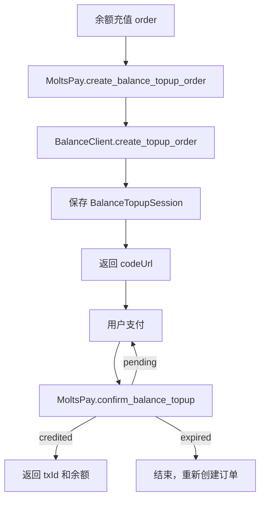
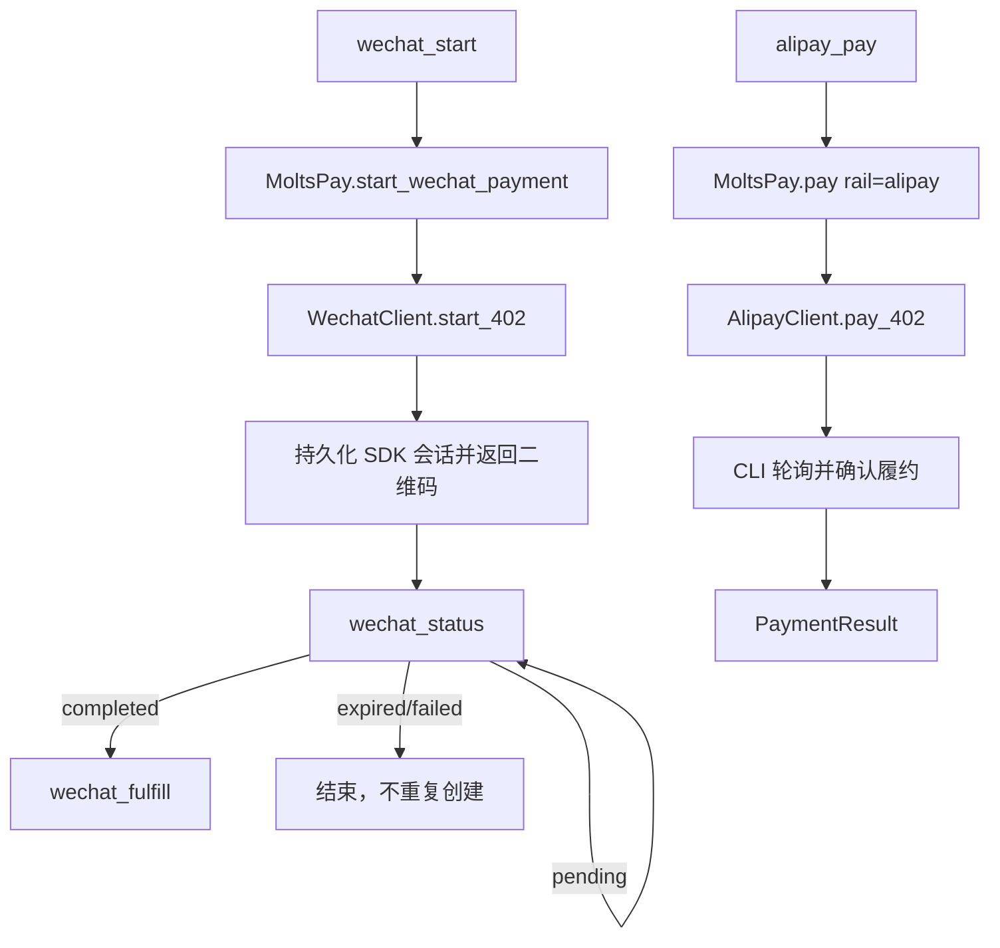

# MCP 微信、支付宝与余额能力扩展设计

## 1. 目标与约束

当前 MCP 已有 `moltspay_status`、`moltspay_services`、`moltspay_pay` 和
`moltspay_config`。其中 `moltspay_pay` 可以选择 `balance`、`wechat`、
`alipay`，但缺少余额查询、充值订单和可恢复的法币支付会话工具。

本设计只增加 MCP 适配层，不重复实现 SDK 已有的支付、账本、HTTP、轮询、
二维码或 CLI 协议。MCP 负责参数校验、确认门禁、结构化序列化和错误映射。

## 2. 目录与模块复用

| 目录/文件 | 已有职责 | MCP 调用方式 | 禁止重复实现 |
|---|---|---|---|
| `src/moltspay/mcp/server.py` | MCP tool 注册、适配和序列化 | 增加薄包装函数 | HTTP、记账、支付轮询 |
| `src/moltspay/client.py` | `MoltsPay` 公共门面、配置、充值会话、微信会话、统一支付 | MCP 只能通过此门面调用 | 不访问私有 client 或 wallet |
| `src/moltspay/balance.py` | `BalanceClient` 查询、交易、充值确认 | 由 `MoltsPay` 转发 | 不新增 `mcp/balance.py` |
| `src/moltspay/wechat.py` | `WechatClient` 会话文件、状态、履约、取消 | 由 `MoltsPay` 转发 | 不新增 MCP session 存储 |
| `src/moltspay/alipay.py` | `AlipayClient`、`alipay-bot` 输出解析 | 由 `MoltsPay.pay(rail="alipay")` 复用 | 不在 MCP 解析 CLI |
| `src/moltspay/models.py` | `BuyerBalance`、`BalanceTopupSession`、`PaymentResult`、`WechatPaymentSession` | `model_dump()` 后转 camelCase | 不定义平行业务模型 |
| `src/moltspay/server/` | provider facilitator、余额账本和法币订单 | 只通过已有 HTTP API 访问 | 不复制 provider 逻辑 |
| `tests/` | SDK、CLI、余额、法币和安全测试 | 增加 MCP adapter/mock 测试 | 不重复业务集成测试 |

若 `MoltsPay` 尚未公开某个底层已有能力，先在 `client.py` 增加最小转发方法，
再由 MCP 调用；不得直接访问 `_balance_client`、`_wechat_client` 或 `_wallet`。

### 2.1 精确调用映射

| MCP 工具 | `MoltsPay` 入口 | 实际底层实现 |
|---|---|---|
| `moltspay_status` | `get_all_balances()`、`get_config()`、`get_buyer_balance()` | 钱包 RPC、`balance.py` |
| `moltspay_balance_query` | `get_buyer_balance()` | `BalanceClient.get_balance()` |
| `moltspay_balance_transactions` | `list_balance_transactions()` | `BalanceClient.list_transactions()` |
| `moltspay_balance_set_buyer` | `update_config(buyer_id=...)` | 本地配置持久化 |
| `moltspay_balance_topup_order` | `create_balance_topup_order()` | `create_topup_order()` + `BalanceTopupSession` |
| `moltspay_balance_topup_confirm` | `confirm_balance_topup()` | `confirm_topup()` |
| `moltspay_balance_topup_status` | `get_balance_topup_session()` | 本地 `balance-topup-sessions` |
| `moltspay_balance_topup_list` | `list_balance_topup_sessions()` | 本地会话目录 |
| `moltspay_wechat_start` | `start_wechat_payment()` | `_rail_challenge()` + `WechatClient.start_402()` |
| `moltspay_wechat_status` | `get_wechat_payment_status()` | `WechatClient.status()` |
| `moltspay_wechat_fulfill` | `fulfill_wechat_payment()` | `WechatClient.fulfill()` |
| `moltspay_wechat_cancel` | `cancel_wechat_payment()` | `WechatClient.cancel()` |
| `moltspay_wechat_list` | `list_wechat_payment_sessions()` | `WechatClient.list_sessions()` |
| `moltspay_alipay_check_wallet` | `AlipayClient.check_wallet()` 的公开转发 | `alipay.py` + CLI |
| `moltspay_alipay_pay` | `pay(..., rail="alipay")` | `_pay_alipay()` + `AlipayClient.pay_402()` |

## 3. 通用输入输出

### 3.1 字段规范

- MCP 输入输出使用 camelCase；SDK 调用时映射为 snake_case。
- 金额使用十进制字符串，例如 `"20.00"`，禁止 MCP 重新计算金额。
- 时间使用 UTC ISO-8601，例如 `2026-08-06T10:30:00Z`。
- `serverUrl`、`buyerId`、`service` 等必填字段不得使用空字符串冒充缺省值。
- `limit` 范围为 1–100，`offset` 不得小于 0。

### 3.2 成功和错误包装

```json
{"ok": true, "data": {}, "requestId": "mcp-uuid", "retried": 0}
```

```json
{
  "ok": false,
  "error": {
    "code": "payment_pending",
    "message": "payment is waiting for user action",
    "retryable": true,
    "retryAfterSeconds": 3,
    "details": {}
  },
  "requestId": "mcp-uuid",
  "retried": 0
}
```

统一错误码：`invalid_input`、`wallet_not_found`、`buyer_id_required`、
`provider_unavailable`、`rate_limited`、`payment_pending`、`payment_expired`、
`payment_rejected`、`insufficient_balance`、`duplicate_operation`、
`dependency_missing`、`confirmation_required`、`wallet_not_ready`。

## 4. 工具契约

### 4.1 状态和余额

`moltspay_status` 输入：

```json
{"serverUrl": "https://provider.example", "buyerId": "buyer-001"}
```

两者可选；无 `serverUrl` 时跳过 CNY 查询。输出：

```json
{
  "address": "0x...",
  "defaultChain": "base",
  "balances": {"base": {"usdc": 10.0}},
  "limits": {"maxPerTx": 10.0, "maxPerDay": 100.0},
  "buyerId": "buyer-001",
  "fiatBalance": {
    "buyerId": "buyer-001", "currency": "CNY", "balance": "84.00",
    "spentToday": "0.01", "singleLimit": "20.00", "dailyLimit": "100.00",
    "status": "active"
  },
  "warnings": []
}
```

链上状态成功但 CNY 查询失败时，保留链上数据，`fiatBalance=null`，追加
warning，不把可选余额依赖故障误报成钱包故障。

`moltspay_balance_query` 输入为 `serverUrl` 和可选 `buyerId`；输出直接复用
`BuyerBalance`：`buyerId`、`currency`、`balance`、`spentToday`、
`singleLimit`、`dailyLimit`、`status`。没有买方 ID 返回 `buyer_id_required`。

`moltspay_balance_transactions` 输入：

```json
{"serverUrl":"https://provider.example","buyerId":"buyer-001","limit":20,"offset":0}
```

输出为 `{ "transactions": [...], "limit": 20, "offset": 0 }`。交易对象
由服务端原样保留，MCP 不自行推导余额。

`moltspay_balance_set_buyer` 输入 `{"buyerId":"buyer-001"}`，调用
`update_config(buyer_id=...)`，输出 `{ "buyerId":"buyer-001", "config":{} }`。
这是本地配置变更，不产生支付。

### 4.2 余额充值

`moltspay_balance_topup_order` 输入：

```json
{"serverUrl":"https://provider.example","pack":"20.00","buyerId":"buyer-001","confirmed":true}
```

调用 `create_balance_topup_order()`，输出 `outTradeNo`、`codeUrl`、`pack`、
`maxTimeoutSeconds`、`status="pending"`、`expiresAt`。此操作只创建订单，
不得声称已经入账。

`moltspay_balance_topup_confirm` 输入 `outTradeNo` 和可选 `serverUrl`，调用
`confirm_balance_topup()`，输出：

```json
{"credited":false,"pending":true,"balance":"64.00","txId":null,"reason":"not paid"}
```

重复确认必须复用服务端幂等结果，不得重复加余额。

`moltspay_balance_topup_status` 输入 `outTradeNo`，调用
`get_balance_topup_session()`；不存在返回 `invalid_input`/`not_found`，不能创建
新订单。输出复用 `BalanceTopupSession`：`outTradeNo`、`buyerId`、`pack`、
`serverUrl`、`codeUrl`、`status`（`pending|credited|expired`）、时间、`txId`、
`balance` 和 `context`。

`moltspay_balance_topup_list` 只读本地会话目录，支持可选 `status` 和 `limit`，
不调用服务端；损坏的单个会话跳过并放入 warnings，不影响其它会话。

### 4.3 微信

`moltspay_wechat_start` 输入：

```json
{"serverUrl":"https://provider.example","service":"service-uuid","params":{"prompt":"a cat"},"confirmed":true}
```

调用 `start_wechat_payment()`，输出直接映射 `WechatPaymentSession`：
`paymentSessionId`、`status`、`resourceUrl`、`method`、`data`、`requirement`、
`codeUrl`、`outTradeNo`、`createdAt`、`updatedAt`、`expiresAt`、`context`、
`lastHttpStatus`、`lastError`、`resultBody`。

`moltspay_wechat_status`、`moltspay_wechat_fulfill`、
`moltspay_wechat_cancel` 都只接受 `{"identifier":"mpay_..."}`，分别转发
到对应 `MoltsPay` 方法。`moltspay_wechat_list` 支持 `status`、`limit`、
`includeExpired`，调用 `list_wechat_payment_sessions()` 后在适配层过滤，
不新增存储查询器。状态为 `pending|paid|completed|expired|cancelled|failed`。

边界：缺少 `codeUrl`/`outTradeNo`、过期会话、非 402/200 响应、未知会话、
重复 fulfill 必须返回明确状态；不能回退到链上支付。

### 4.4 支付宝

`moltspay_alipay_check_wallet` 输入可选 `executable`，默认 `alipay-bot`；
只调用 `AlipayClient.check_wallet()`。成功输出
`{ "ready":true, "executable":"alipay-bot", "walletStatus":"opened_bound" }`。
CLI 缺失返回 `dependency_missing`，钱包未打开返回 `wallet_not_ready`。

`moltspay_alipay_pay` 输入：

```json
{"serverUrl":"https://provider.example","service":"service-uuid","params":{"prompt":"a cat"},"framework":"openclaw","timeoutSeconds":1800,"pollIntervalSeconds":3,"confirmed":true}
```

调用 `MoltsPay.pay(..., rail="alipay")`，输出统一 `PaymentResult` 映射并补充
`tradeNo`、`outTradeNo`、`paymentUrl`（若 CLI 提供）。MCP 不解析 CLI 文本；
`AlipayClient` 负责 trade number、URL 和状态解析。

## 5. 流程图





## 6. 重试、轮询和幂等

### 6.1 重试归属

优先复用 SDK 当前 timeout、`WechatClient.poll_session()`、
`AlipayClient.pay_402()` 和 `topup_balance_pack()` 的行为。若需要统一重试，
应在 `mcp/server.py` 增加一个通用的、仅包裹“只读查询”的 helper，不在每个
工具中复制 retry loop。

只对连接错误、读取超时、408、429、500、502、503、504 重试，最多 3 次；
退避为 `min(30, 2^attempt) + random(0, .25)`，优先使用 `Retry-After`。

### 6.2 不可盲目重试

- 充值订单创建：超时后先查本地/服务端订单，不重复 POST；
- 支付宝 `402-buyer-pay`：不得再次执行支付命令；
- 微信 start：不得在未知结果时重新创建订单；
- 确认充值和 fulfill 可以重试，因为已有 `outTradeNo` 或会话 ID 幂等键。

### 6.3 轮询边界

| 场景 | SDK 已有入口 | 默认间隔 | 截止时间 |
|---|---|---:|---:|
| 微信状态 | `WechatClient.poll_session()` | 3 秒 | `expiresAt` 或 300 秒 |
| 余额确认 | `confirm_balance_topup()` | 2 秒 | `maxTimeoutSeconds` 或 300 秒 |
| 支付宝状态 | `AlipayClient.pay_402()` | 3 秒 | `timeoutSeconds`，默认 1800 秒 |

轮询不得超过原始业务截止时间。未知网络结果返回 `status="unknown"` 和
`retryable=true`，指导调用方查询状态而不是重新发起资金操作。

## 7. 确认、安全和 dry-run

`MOLTSPAY_MCP_REQUIRE_CONFIRM=1` 时，充值订单、微信 start/fulfill、支付宝
支付以及 `moltspay_pay` 的法币/余额 rail 必须 `confirmed=true`。查询、列表、
status 和配置读取无需确认。

`--dry-run` 只能生成 intent，不创建充值订单、不调用 `start_402`、不调用
`alipay-bot`、不写支付会话。MCP 不返回私钥、认证头、商户私钥或支付宝凭证。

## 8. 边界情况矩阵

| 情况 | 处理 |
|---|---|
| 钱包不存在 | 启动时沿用现有错误 `wallet_not_found` |
| buyer ID 缺失 | 查询/充值前返回 `buyer_id_required` |
| server URL 缺失 | 本地会话查询可用；远程查询返回 `invalid_input` |
| 金额负数、超过两位小数或为零 | 不调用 SDK，返回 `invalid_input` |
| 远程 404 | 保留 SDK 原错误；查询类返回 not found，支付类不得 fallback |
| 429/5xx | 只按统一策略重试，可恢复时返回 `retryable=true` |
| 会话文件损坏 | 单条跳过并 warning；指定 ID 查询返回 not found |
| 订单已入账 | 返回原 `txId` 和余额，不能重复 credit |
| 支付已过期 | 返回 `payment_expired`，要求新建订单 |
| 支付已拒绝 | 返回 `payment_rejected`，不自动重试付款 |
| `alipay-bot` 缺失 | `dependency_missing`，不调用 provider |

## 9. 实施和验收

1. 先在 `client.py` 补齐缺失的最小公开转发方法；
2. 只在 `mcp/server.py` 增加薄工具和共用序列化/错误 helper；
3. 使用已有模型字段，新增字段仅用于 MCP camelCase 映射；
4. 在 `tests/` 增加 MCP 注册、参数、mock 门面和边界测试；
5. 验收工具可通过 `tools/list` 发现，dry-run 无副作用，重复确认幂等，
   重启后会话可恢复，并运行完整 Python 测试套件。

